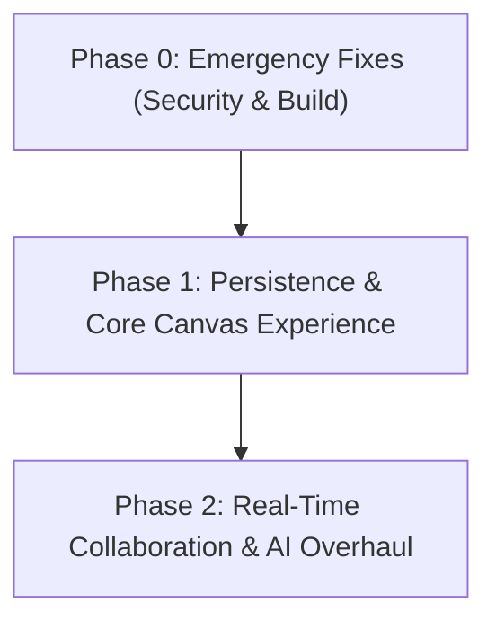

# DraftSpace Codebase Audit Report

> **Audit Date:** October 3, 2026  
> **Target Workspace:** `d:\Codes\draftspace-h8` (`draftspace`)  
> **Audit Mode:** READ-ONLY Deep Technical Audit  

---

## 1. Executive Summary

DraftSpace is intended to be an AI-powered collaborative whiteboard where users draw on an Excalidraw canvas and execute inline AI commands (`{ ai: ... }`, `{ img: ... }`, `{ code: ... }`).

**Current Status:** The repository is in a **partially functional, severely mismatched, and insecure state**. Key findings include:
1. **Critical Security Vulnerabilities:** Unauthenticated IDOR endpoints permit any user to read, overwrite, or **permanently delete** any board in MongoDB without authentication.
2. **Phantom Features:** Real-time collaboration via Socket.io and custom `server.js` (both claimed extensively in documentation) **do not exist in the codebase**.
3. **Broken Auto-Save:** The auto-save hook (`useBoardSync`) is defined but **never invoked on canvas changes** in `HomeContent.tsx`, meaning canvas state is never saved automatically.
4. **Mismatched AI Pipeline:** README claims Anthropic Claude API powers text/code and commands are typed in canvas text elements. In reality, Google Gemini powers all AI routes, `@anthropic-ai/sdk` is not installed, and commands only work via a floating fixed bottom input bar (`CommandInput.tsx`).
5. **Failing Build & Lint:** `tsc --noEmit` fails with 7 TypeScript compilation errors, and `npm run lint` fails completely due to missing ESLint flat configuration for ESLint v9.

---

## 2. Architecture & Data Flow Map

### Folder Structure (Actual vs Claimed)
```
draftspace-h8/
├── app/
│   ├── api/
│   │   ├── ai/
│   │   │   ├── code/route.ts       (Gemini code generation)
│   │   │   ├── image/route.ts      (Gemini image generation)
│   │   │   └── text/route.ts       (Gemini text streaming)
│   │   ├── auth/
│   │   │   ├── [...nextauth]/route.ts (NextAuth Credentials + Google)
│   │   │   └── signup/route.ts     (User registration)
│   │   ├── boards/
│   │   │   ├── route.ts            (GET list, POST create)
│   │   │   └── [id]/route.ts       (GET, PUT, DELETE board)
│   │   └── rooms/
│   │       ├── create/route.ts     (POST create ephemeral room)
│   │       ├── get/route.ts        (GET ephemeral room)
│   │       └── save/route.ts       (POST save ephemeral room)
│   ├── dashboard/page.tsx          (User board list UI)
│   ├── login/page.tsx
│   ├── signup/page.tsx
│   ├── HomeContent.tsx             (Main canvas workspace)
│   ├── layout.tsx
│   └── page.tsx
├── components/
│   ├── ui/                         (Shadcn UI primitive components)
│   ├── AIResultCard.tsx
│   ├── Canvas.tsx                  (Dynamic Excalidraw wrapper)
│   ├── CommandInput.tsx            (Floating AI command bar)
│   ├── Navbar.tsx
│   ├── SaveStatus.tsx              (Auto-save status indicator)
│   └── ...
├── hooks/
│   ├── useAICommand.ts             (AI execution hook - currently unused in main view)
│   ├── useBoardSync.ts             (Board fetch/save & auto-save hook)
│   └── use-toast.ts
├── lib/
│   ├── api/
│   │   ├── ai-shared.ts            (Rate limiting, CORS, response helpers)
│   │   ├── image-config.ts
│   │   └── language-detect.ts
│   ├── ai-client.ts                (Frontend fetch wrappers for AI routes)
│   ├── canvasManager.ts            (Excalidraw element creation helpers)
│   ├── commandParser.ts            (RegEx command parser - unused by CommandInput)
│   ├── mongodb.ts                  (Mongoose connection cache)
│   └── draftspace-settings.ts
├── models/
│   ├── Board.ts                    (Mongoose Board schema)
│   ├── Room.ts                     (Mongoose Room schema with 24h TTL)
│   └── User.ts                     (Mongoose User schema)
├── middleware.ts                   (Route protection for /collaboration, /live, /room)
└── package.json
```

---

### Data Flow Traces

#### (a) Command Parse $\rightarrow$ API Route $\rightarrow$ Canvas Element
1. **Trigger:** User types into the floating `<textarea>` in [`components/CommandInput.tsx`](file:///d:/Codes/draftspace-h8/components/CommandInput.tsx) (NOT inside Excalidraw text elements on canvas).
2. **Parsing:** [`CommandInput.tsx`](file:///d:/Codes/draftspace-h8/components/CommandInput.tsx#L63-L73) runs an inline regex `/\{\s*(ai|img|code)\s*:\s*([^}]*)\}/i`. (Note: ignores [`lib/commandParser.ts`](file:///d:/Codes/draftspace-h8/lib/commandParser.ts)).
3. **Execution:** Calls [`streamTextAi`](file:///d:/Codes/draftspace-h8/lib/ai-client.ts#L18), [`callImageAi`](file:///d:/Codes/draftspace-h8/lib/ai-client.ts#L95), or [`callCodeAi`](file:///d:/Codes/draftspace-h8/lib/ai-client.ts#L140) in `lib/ai-client.ts`.
4. **API Route:** Requests hit [`/api/ai/text`](file:///d:/Codes/draftspace-h8/app/api/ai/text/route.ts), [`/api/ai/image`](file:///d:/Codes/draftspace-h8/app/api/ai/image/route.ts), or [`/api/ai/code`](file:///d:/Codes/draftspace-h8/app/api/ai/code/route.ts). The server invokes `@google/generative-ai` (`gemini-2.5-flash`) or `@google/genai` (`gemini-3.1-flash-image-preview`).
5. **Canvas Insertion:** Upon API response, `CommandInput.tsx` invokes helper functions in [`lib/canvasManager.ts`](file:///d:/Codes/draftspace-h8/lib/canvasManager.ts) (`addAITextToCanvas`, `addAIImageToCanvas`, or `addAICodeToCanvas`).
6. **Scene Update:** `canvasManager.ts` calls `excalidrawAPI.updateScene()` to append elements directly to the active Excalidraw instance.

#### (b) Auto-Save
1. **Hook Definition:** [`hooks/useBoardSync.ts`](file:///d:/Codes/draftspace-h8/hooks/useBoardSync.ts) exports `autoSave()`, which debounces save operations by 3 seconds (`setTimeout(..., 3000)`).
2. **Current Integration (Broken):** [`app/HomeContent.tsx`](file:///d:/Codes/draftspace-h8/app/HomeContent.tsx#L349-L351) defines `handleCanvasChange`, but only calls `setCanvasData({ elements, appState })`. It **never calls `autoSave` or `saveBoard`**.
3. **Result:** Board changes on the canvas are **never automatically persisted to MongoDB**.
4. **Data Loss Risk:** `useBoardSync.ts` clears `autoSaveTimeoutRef` on unmount without flushing pending saves.

#### (c) Socket.io Real-Time Sync
1. **Claimed Flow:** Canvas changes throttled at 80ms and broadcast via `server.js` Socket.io rooms.
2. **Actual Flow:** **NON-EXISTENT**. There is no `server.js`, no `socket.io` dependency, and no WebSocket handling code anywhere in the repo. [`components/Navbar.tsx`](file:///d:/Codes/draftspace-h8/components/Navbar.tsx#L85-L89) hardcodes a static `"● Live"` status pill.

#### (d) Auth & Middleware
1. **Middleware Matching:** [`middleware.ts`](file:///d:/Codes/draftspace-h8/middleware.ts#L36) matches everything except `api/`, `_next/static`, `_next/image`, `favicon.ico`.
2. **Page Protection:** Middleware checks JWT tokens ONLY for paths starting with `/collaboration`, `/live`, or `/room`. It **omits `/dashboard`** (which relies solely on a client-side redirect in `app/dashboard/page.tsx`).
3. **API Exclusions:** Because `api/` is excluded from middleware, all API routes must handle authorization internally. However, board API routes fail to enforce checks properly.

---

## 3. Build & Lint Results

### TypeScript Verification (`tsc --noEmit`)
**Status:** FAILED (7 errors across 3 files)

```
app/api/auth/[...nextauth]/route.ts(120,26): error TS2345: Argument of type '{ providers: (CredentialsConfig<{ email: { label: string; type: string; }; password: { label: string; type: string; }; }> | OAuthConfig<GoogleProfile>)[]; session: { ...; }; callbacks: { ...; }; pages: { ...; }; }' is not assignable to parameter of type 'AuthOptions'.
  The types of 'session.strategy' are incompatible between these types.
    Type 'string' is not assignable to type 'SessionStrategy | undefined'.
app/HomeContent.tsx(38,15): error TS2304: Cannot find name 'ToolType'.
app/HomeContent.tsx(93,48): error TS2304: Cannot find name 'ToolType'.
app/HomeContent.tsx(195,47): error TS2304: Cannot find name 'ToolType'.
app/HomeContent.tsx(372,13): error TS2322: Type '{ gridEnabled: boolean; snapToGridEnabled: boolean; darkMode: boolean; strokeColor: string; strokeWidth: number; activeTool: ToolType; onExcalidrawAPI: Dispatch<any>; onChange: (elements: any[], appState: any) => void; }' is not assignable to type 'IntrinsicAttributes & CanvasProps'.
  Property 'snapToGridEnabled' does not exist on type 'IntrinsicAttributes & CanvasProps'.
app/HomeContent.tsx(384,21): error TS2322: Type '{ loading: boolean; saving: boolean; error: string | null; lastSavedTime: Date | null; }' is not assignable to type 'IntrinsicAttributes & SaveStatusProps'.
  Property 'loading' does not exist on type 'IntrinsicAttributes & SaveStatusProps'.
hooks/useBoardSync.ts(120,46): error TS2345: Argument of type 'string | null' is not assignable to parameter of type 'string'.
  Type 'null' is not assignable to type 'string'.
hooks/useBoardSync.ts(150,44): error TS2345: Argument of type 'string | null' is not assignable to parameter of type 'string'.
  Type 'null' is not assignable to type 'string'.
```

### ESLint Verification (`npm run lint` / `eslint .`)
**Status:** FAILED

```
Oops! Something went wrong! :(

ESLint: 9.39.4

ESLint couldn't find an eslint.config.(js|mjs|cjs) file.

From ESLint v9.0.0, the default configuration file is now eslint.config.js.
If you are using a .eslintrc.* file, please follow the migration guide
to update your configuration file to the new format:

https://eslint.org/docs/latest/use/configure/migration-guide
```

### Production Build (`next build`)
**Status:** SKIPPED (Per method rules, `next build` was skipped because `tsc` and `lint` failed).

---

## 4. Bugs Register

| ID | Severity | File : Line | Issue Summary | Technical Evidence | Proposed Fix | Confidence |
|---|---|---|---|---|---|---|
| **BUG-01** | **Critical** | [`app/api/boards/[id]/route.ts:105-149`](file:///d:/Codes/draftspace-h8/app/api/boards/%5Bid%5D/route.ts#L105-L149) | Unauthenticated Board Deletion (IDOR) | Line 127 checks `if (session?.user?.email && board.owner)`. Unauthenticated users have `session = undefined`, skipping the ownership check entirely and proceeding to `Board.findByIdAndDelete(id)`. | Require valid session first: `if (!session?.user?.email) return 401`. Verify `board.owner` matches logged-in user ID. | High |
| **BUG-02** | **Critical** | [`app/api/boards/[id]/route.ts:42-102`](file:///d:/Codes/draftspace-h8/app/api/boards/%5Bid%5D/route.ts#L42-L102) | Unauthenticated Board Overwrite (IDOR) | `PUT /api/boards/[id]` has no session check or ownership verification. Anyone can overwrite any board's elements and title. | Add `getServerSession()` and verify board ownership before calling `findByIdAndUpdate`. | High |
| **BUG-03** | **Critical** | [`app/api/boards/[id]/route.ts:12-39`](file:///d:/Codes/draftspace-h8/app/api/boards/%5Bid%5D/route.ts#L12-L39) | Unauthorized Board Read (IDOR) | `GET /api/boards/[id]` fetches and returns board content without checking if the board is public or owned by the requesting user. | Check `board.isPublic` or match `board.owner` against the current user session. | High |
| **BUG-04** | **High** | [`app/HomeContent.tsx:349-351`](file:///d:/Codes/draftspace-h8/app/HomeContent.tsx#L349-L351) | Auto-Save Never Triggered | `handleCanvasChange` only updates local React state (`setCanvasData`). It never calls `autoSave()` from `useBoardSync`. | Call `autoSave(elements, appState, boardTitle)` inside `handleCanvasChange`. | High |
| **BUG-05** | **High** | [`app/HomeContent.tsx:384`](file:///d:/Codes/draftspace-h8/app/HomeContent.tsx#L384) | SaveStatus Component Props Mismatch | `HomeContent` passes `<SaveStatus loading={...} saving={...} lastSavedTime={...} />`, but `SaveStatusProps` expects `isSaving`, `lastSaved`, and `error`. Status indicator remains blank/broken. | Update `HomeContent.tsx` prop names to match `SaveStatusProps` (`isSaving={savingBoard}`, `lastSaved={lastSavedTime}`). | High |
| **BUG-06** | **High** | [`hooks/useBoardSync.ts:88-161`](file:///d:/Codes/draftspace-h8/hooks/useBoardSync.ts#L88-L161) | Board Creation Race Condition | `saveBoard` callback depends on `[boardId]`. When creating a new board, `setBoardId(targetBoardId)` is async. Consecutive calls use stale `boardId=null` closure, creating duplicate boards. | Use a `ref` (`boardIdRef.current`) to track board ID synchronously inside `saveBoard`. | High |
| **BUG-07** | **Medium** | [`lib/commandParser.ts:14-41`](file:///d:/Codes/draftspace-h8/lib/commandParser.ts#L14-L41) | Command Parser Fails on Nested Braces | RegEx uses non-greedy `(.*?)` up to `}`. Prompt `{ ai: code like if (x) { return true; } }` truncates at first `}`. | Use balanced brace matching / stack parser instead of shallow regex. | High |
| **BUG-08** | **Medium** | [`hooks/useBoardSync.ts:195-201`](file:///d:/Codes/draftspace-h8/hooks/useBoardSync.ts#L195-L201) | Data Loss on Tab Close | Debounced auto-save timer is cleared on unmount without flushing pending changes to the server. | Add a `beforeunload` listener and flush pending changes via `navigator.sendBeacon`. | Medium |
| **BUG-09** | **Medium** | [`hooks/useBoardSync.ts:120,150`](file:///d:/Codes/draftspace-h8/hooks/useBoardSync.ts#L120) | TypeScript Type Error on URL Param | `targetBoardId` is typed `string \| null`, causing `searchParams.set('board', targetBoardId)` to fail type checking. | Add null guard before calling `searchParams.set()`. | High |
| **BUG-10** | **Low** | [`components/Navbar.tsx:85-89`](file:///d:/Codes/draftspace-h8/components/Navbar.tsx#L85-L89) | Hardcoded Live Status Indicator | Navbar defaults `isConnected = true` and renders "● Live" despite no socket connection existing. | Connect indicator to real socket connection state once implemented. | High |

---

## 5. Security Audit

### 1. Authentication & Authorization (IDOR)
* **Finding:** All board operations by ID (`/api/boards/[id]`) lack ownership verification. An unauthenticated attacker can read, update, or delete any board in the database by ID.
* **Risk Level:** **CRITICAL**. Data leakage and total data destruction.

### 2. OAuth Dangerous Email Linking
* **Finding:** [`app/api/auth/[...nextauth]/route.ts:48`](file:///d:/Codes/draftspace-h8/app/api/auth/%5B...nextauth%5D/route.ts#L48) sets `allowDangerousEmailAccountLinking: true`.
* **Risk Level:** **HIGH**. Allows pre-existing password accounts to be hijacked if an unverified OAuth provider profile shares the same email address.

### 3. API Key & Resource Cost Abuse
* **Finding:** All AI routes ([`/api/ai/text`](file:///d:/Codes/draftspace-h8/app/api/ai/text/route.ts), [`/api/ai/code`](file:///d:/Codes/draftspace-h8/app/api/ai/code/route.ts), [`/api/ai/image`](file:///d:/Codes/draftspace-h8/app/api/ai/image/route.ts)) are publicly accessible without authentication.
* **Risk Level:** **HIGH**. Anyone on the internet can send automated POST requests to `/api/ai/image` to exhaust server quota and incur financial cost on the server owner's Gemini API key.

### 4. Permissive CORS Headers
* **Finding:** [`lib/api/ai-shared.ts:10-15`](file:///d:/Codes/draftspace-h8/lib/api/ai-shared.ts#L10-L15) sets `"Access-Control-Allow-Origin": "*"`.
* **Risk Level:** **MEDIUM**. Enables any third-party website to make cross-origin requests to the host's AI endpoints.

### 5. In-Memory Rate Limiting Flaw
* **Finding:** Rate limiting in [`lib/api/ai-shared.ts:33`](file:///d:/Codes/draftspace-h8/lib/api/ai-shared.ts#L33) uses an in-memory JS `Map`.
* **Risk Level:** **MEDIUM**. Resets on every serverless function invocation (e.g. Vercel) or process restart. In production behind reverse proxies without `x-forwarded-for`, all clients fall back to `"localhost"`, rate-limiting all users simultaneously.

### 6. Public `/` Canvas Abuse
* **Finding:** Unauthenticated users can use AI routes on `/` without rate limits or user accounting.

---

## 6. Unfinished Work

| Feature Area | Current State | Affected Files | Effort to Complete |
|---|---|---|---|
| **Real-Time Collaboration** | 0% implemented (Phantom feature) | `server.js` (missing), `components/Canvas.tsx`, `hooks/useBoardSync.ts` | **Large (L)** |
| **Auto-Save Pipeline** | 60% implemented (Hook written, integration broken) | [`app/HomeContent.tsx`](file:///d:/Codes/draftspace-h8/app/HomeContent.tsx), [`hooks/useBoardSync.ts`](file:///d:/Codes/draftspace-h8/hooks/useBoardSync.ts) | **Small (S)** |
| **Inline Canvas Text Command Detection** | 20% implemented (Input bar exists, canvas text binding missing) | [`lib/canvasManager.ts`](file:///d:/Codes/draftspace-h8/lib/canvasManager.ts), [`components/Canvas.tsx`](file:///d:/Codes/draftspace-h8/components/Canvas.tsx) | **Medium (M)** |
| **ESLint v9 Migration** | 0% implemented | `eslint.config.js` (missing) | **Small (S)** |
| **Dashboard Route Protection** | 50% implemented (Client-side redirect only) | [`middleware.ts`](file:///d:/Codes/draftspace-h8/middleware.ts), [`app/dashboard/page.tsx`](file:///d:/Codes/draftspace-h8/app/dashboard/page.tsx) | **Small (S)** |

---

## 7. README vs Reality Matrix

| Claim in README | Reality in Codebase | Mismatch Severity |
|---|---|---|
| **Node server.js** (`node server.js Starts Next.js + Socket.io`) | File `server.js` **does not exist**. App runs via standard `next dev`/`next build`. | **Critical** |
| **Socket.io 4.x Real-Time Sync** (80ms throttled broadcast) | `socket.io` and `socket.io-client` are **not installed**; 0 socket code exists. | **Critical** |
| **Anthropic Claude API** for text and code | `@anthropic-ai/sdk` is **not installed**; code uses Google Gemini (`gemini-2.5-flash`). | **High** |
| **Zustand State Management** | `zustand` is **not in dependencies** or used in application code. | **Medium** |
| **Next.js 14 App Router** | `package.json` specifies `"next": "16.2.0"` and `"react": "19.2.4"`. | **Medium** |
| **Inline Canvas Commands** (detects `{ ai: }` in Excalidraw text elements) | Text elements on canvas are ignored. Commands only work in floating bottom input. | **High** |
| **Project Structure** (`app/(canvas)`, `lib/hooks`, `lib/models`, `app/api/image`) | Directories are actually `app/`, `hooks/`, `models/`, `app/api/ai/image`. | **Low** |
| **Package Name** (`DraftSpace`) | `package.json` names the project `"my-project"`. | **Low** |
| **GitHub repository links** (`github.com/yourusername/draftspace`) | Links contain unreplaced template placeholders. | **Low** |

---

## 8. Technical Debt & Repo Hygiene

1. **Duplicate Lockfiles:** Both `package-lock.json` and `pnpm-lock.yaml` are present in the repo root.
2. **Committed Build Artifact:** [`tsconfig.tsbuildinfo`](file:///d:/Codes/draftspace-h8/tsconfig.tsbuildinfo) is tracked and committed in git.
3. **Unused Dependencies / Files:**
   - `pnpm-workspace.yaml` present in a single package repository.
   - `components/ui/` contains 40+ generated Shadcn primitive components that are never imported (e.g., `carousel.tsx`, `chart.tsx`, `drawer.tsx`, `pagination.tsx`).
4. **Duplicate Utility / Hook Files:**
   - [`hooks/use-toast.ts`](file:///d:/Codes/draftspace-h8/hooks/use-toast.ts) and [`components/ui/use-toast.ts`](file:///d:/Codes/draftspace-h8/components/ui/use-toast.ts) are identical duplicates.
   - [`hooks/use-mobile.ts`](file:///d:/Codes/draftspace-h8/hooks/use-mobile.ts) and [`components/ui/use-mobile.tsx`](file:///d:/Codes/draftspace-h8/components/ui/use-mobile.tsx) are duplicate implementations.
5. **Console Logging:** Raw `console.log` statements are present across production routes ([`lib/api/ai-shared.ts`](file:///d:/Codes/draftspace-h8/lib/api/ai-shared.ts), [`app/HomeContent.tsx`](file:///d:/Codes/draftspace-h8/app/HomeContent.tsx), [`app/api/auth/[...nextauth]/route.ts`](file:///d:/Codes/draftspace-h8/app/api/auth/%5B...nextauth%5D/route.ts)).

---

## 9. Drastic-Change Recommendations

1. **Deployment Architecture (Vercel vs Persistent Server):**
   - *Current Situation:* README claims deployment to Vercel/Railway with custom `server.js` WebSockets. Vercel serverless functions **cannot host persistent Socket.io WebSocket servers**.
   - *Recommendation:* If deploying to Vercel, replace custom Socket.io with a managed real-time service (e.g., **Liveblocks**, **Ably**, or **Supabase Realtime**). If custom WebSockets are required, host the WebSocket server on a dedicated Node/Docker container (e.g., Railway/Render) separate from the Next.js frontend.
2. **AI Command Architecture:**
   - *Current Situation:* Commands must be typed into a fixed bottom input bar, violating the core pitch of "inline canvas commands".
   - *Recommendation:* Hook into Excalidraw's `onChange` event to inspect modified text elements. When a text element ending with `}` matches a command pattern on blur or Enter, replace the text element inline with a loading spinner / AI response element on the canvas.
3. **Authentication & Authorization Overhaul:**
   - Secure all `/api/boards/*` routes by extracting user ID from NextAuth session tokens and asserting ownership.
   - Add session requirements or user-level token bucket rate limits to AI routes to prevent API key billing abuse.

---

## 10. Prioritized Roadmap



### Phase 0: Emergency Fixes (Days 1–2)
- [ ] Fix IDOR vulnerabilities in [`app/api/boards/[id]/route.ts`](file:///d:/Codes/draftspace-h8/app/api/boards/%5Bid%5D/route.ts) (enforce session + ownership check on GET, PUT, DELETE).
- [ ] Disable `allowDangerousEmailAccountLinking` in NextAuth.
- [ ] Resolve 7 `tsc --noEmit` compilation errors in [`app/HomeContent.tsx`](file:///d:/Codes/draftspace-h8/app/HomeContent.tsx), [`hooks/useBoardSync.ts`](file:///d:/Codes/draftspace-h8/hooks/useBoardSync.ts), and [`app/api/auth/[...nextauth]/route.ts`](file:///d:/Codes/draftspace-h8/app/api/auth/%5B...nextauth%5D/route.ts).
- [ ] Create `eslint.config.mjs` for ESLint 9 compatibility so `npm run lint` passes.
- [ ] Add `/dashboard` to [`middleware.ts`](file:///d:/Codes/draftspace-h8/middleware.ts) matcher and path protection.

### Phase 1: Persistence & Core Canvas Experience (Days 3–5)
- [ ] Connect `autoSave` in [`app/HomeContent.tsx`](file:///d:/Codes/draftspace-h8/app/HomeContent.tsx#L349) inside `handleCanvasChange`.
- [ ] Fix prop names passed to `<SaveStatus />` in `HomeContent.tsx`.
- [ ] Fix `boardId` race condition ref in `useBoardSync.ts`.
- [ ] Add `beforeunload` event listener and `sendBeacon` fallback for unmount auto-saving.
- [ ] Clean up duplicate lockfiles (`package-lock.json` vs `pnpm-lock.yaml`) and remove `tsconfig.tsbuildinfo` from git.

### Phase 2: Real-Time Collaboration & AI Overhaul (Days 6–10)
- [ ] Implement actual real-time collaboration layer (Liveblocks or Socket.io standalone server).
- [ ] Implement true inline canvas text element command parser (hook Excalidraw text element blur/change).
- [ ] Replace in-memory rate limiter with Redis / Upstash rate limiting for multi-instance deployment.
- [ ] Reconcile README claims with actual implementation.

---

## 11. Open Questions for Strategy Alignment

1. **Target Hosting Provider:** Are you deploying to Vercel (serverless) or a persistent server (Railway/Render/AWS)? *This determines whether real-time sync should use a serverless provider (Liveblocks) or custom Socket.io container.*
2. **AI Provider Preference:** Should text/code generation remain on Google Gemini, or do you want to install `@anthropic-ai/sdk` and migrate text/code to Anthropic Claude as documented in the README?
3. **Public Canvas Policy:** Should anonymous users on `/` be allowed to use server-funded AI generation, or should AI commands require signing in with an account?
